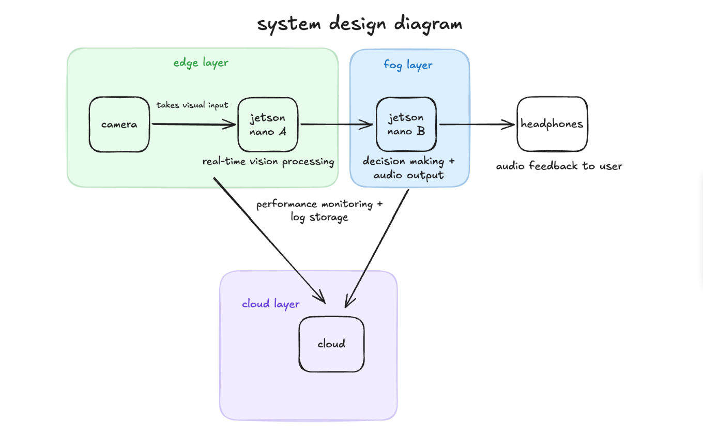

# EdgeVision Walking Aid

EdgeVision Walking Aid is a wearable assistive technology prototype designed to help visually impaired users receive real-time audio warnings about nearby hazards.

The system uses **Python, YOLOv8n, Depth Anything V2, TensorRT, and Jetson Orin Nano** to detect nearby objects, estimate their distance, rank hazards, and generate spoken audio alerts through headphones.

---

## Table of Contents

- [Overview](#overview)
- [Problem / Use Case](#problem--use-case)
- [System Overview](#system-overview)
- [How It Works](#how-it-works)
- [Tech Stack](#tech-stack)
- [Key Features](#key-features)
- [Repository Structure](#repository-structure)
- [Results](#results)
- [Setup / Running the Project](#setup--running-the-project)
- [Future Improvements](#future-improvements)
- [Disclaimer](#disclaimer)

---

## Overview

EdgeVision Walking Aid is an embedded AI walking aid prototype that helps users understand nearby obstacles through spoken feedback.

The project uses a two-device Jetson architecture:

- **Jetson Nano A / Edge Node** handles real-time vision processing.
- **Jetson Nano B / Audio-Fog Node** receives hazard messages and converts them into spoken warnings.
- **Optional Cloud Logging** stores non-real-time detection and performance logs for monitoring and analysis.

The main goal of the system is to keep safety-critical processing local so the user can still receive alerts without depending on cloud latency or internet availability.

---

## Problem / Use Case

Visually impaired users often need fast, reliable awareness of nearby obstacles such as people, vehicles, signs, poles, or other objects in their environment.

For a walking aid system, latency matters. If object detection depends too heavily on cloud processing, network delays could make warnings arrive too late. EdgeVision addresses this by running object detection and depth estimation locally on Jetson hardware.

The system is designed to:

- Detect nearby objects in real time
- Estimate how far away objects are from the user
- Rank hazards by distance and urgency
- Send only the most important warnings to the user
- Provide spoken feedback through headphones

---

## System Overview




EdgeVision is organized into three main parts:

### 1. Jetson Nano A — Edge Vision Node

The edge node is responsible for real-time perception.

It:

- Captures live camera frames
- Runs YOLOv8n object detection
- Runs Depth Anything V2 depth estimation
- Estimates object distance
- Filters objects using hazard thresholds
- Sends hazard messages to the audio node

### 2. Jetson Nano B — Audio-Fog Node

The audio-fog node handles warning decisions and user feedback.

It:

- Receives hazard packets from Jetson Nano A
- Prioritizes urgent hazards
- Prevents repeated or stale alerts
- Converts selected warnings into speech
- Sends audio output through headphones

### 3. Optional Cloud Logging

The cloud layer is not used for real-time safety decisions.

It is only intended for:

- Performance monitoring
- Detection logs
- Debugging
- Future model improvement
- Non-real-time analysis

This helps preserve privacy and reduce latency because raw real-time video processing stays on the Jetson devices.

---

## How It Works

```txt
Camera
  ↓
Jetson Nano A / Edge Node
  ↓
YOLOv8n Object Detection
  ↓
Depth Anything V2 Distance Estimation
  ↓
Hazard Filtering + Urgency Ranking
  ↓
TCP Message to Jetson Nano B
  ↓
Priority Queue + Text-to-Speech
  ↓
Headphones
```

Example spoken warning:

```txt
Warning - car on your right, 3 meters
```

Example hazard message:

```json
{
  "label": "car",
  "distance_m": 3.0,
  "direction": "on your right",
  "urgency": "high",
  "conf": 0.91
}
```

---

## Tech Stack

### Languages

- Python

### AI / Computer Vision

- YOLOv8n
- Depth Anything V2
- OpenCV
- PyTorch
- TensorRT

### Hardware / Embedded AI

- Jetson Orin Nano
- CSI / USB camera
- Headphones or speaker output

### Systems / Communication

- TCP sockets
- JSON hazard messages
- Priority queue logic
- Text-to-speech audio alerts

### Optional Cloud Layer

- Cloud logging prototype
- Performance monitoring logs
- Detection/event records

---

## Key Features

- Real-time object detection using YOLOv8n
- Metric depth estimation using Depth Anything V2
- TensorRT acceleration for Jetson deployment
- Local edge processing for low-latency safety decisions
- Hazard ranking based on distance and urgency
- TCP communication between two Jetson boards
- Audio warning system using text-to-speech
- Cooldown logic to reduce repeated alerts
- Stale alert filtering to avoid late warnings
- Optional privacy-aware cloud logging for non-real-time monitoring

---

## Repository Structure

```txt
edgevision-walking-aid/
├── README.md
├── LICENSE
├── requirements.txt
├── .gitignore
├── src/
│   └── edgevision/
│       ├── __init__.py
│       ├── camera.py
│       ├── cloud_logger.py
│       ├── config.py
│       ├── depth.py
│       ├── detector.py
│       ├── hazard_logic.py
│       ├── networking.py
│       └── receiver.py
└── media/
    └── system_design_diagram.png
```

### Main Modules

| File | Purpose |
|---|---|
| `detector.py` | Runs the main vision pipeline on Jetson Nano A |
| `receiver.py` | Receives alerts and generates spoken audio warnings on Jetson Nano B |
| `camera.py` | Handles camera capture for the vision node |
| `depth.py` | Handles Depth Anything V2 preprocessing and depth inference |
| `hazard_logic.py` | Classifies urgency, ranks hazards, and filters alerts |
| `networking.py` | Sends hazard messages between Jetson boards using TCP |
| `cloud_logger.py` | Optional privacy-aware logging for detections and performance |
| `config.py` | Stores model paths, thresholds, ports, and system settings |

---

## Results

The final demo successfully demonstrated the main functionality of an edge-based walking aid prototype.

The system was able to:

- Detect nearby objects using YOLOv8n
- Estimate object distance using Depth Anything V2
- Send hazard information from Jetson Nano A to Jetson Nano B
- Generate spoken audio alerts for the user
- Keep real-time detection and warning logic local to the Jetson devices

This showed how a few components can communicate with eachother effectively and provide instant and useful feedback of one's surroundings.

---

## Setup / Running the Project

> Note: This project is designed for Jetson hardware and may not run fully on a regular laptop without modification.

### Hardware Setup

This prototype uses two Jetson Orin Nano boards connected together with a standard Ethernet cable.

| Device | Purpose |
|---|---|
| Jetson Nano A | Vision node for camera input, object detection, and depth estimation |
| Jetson Nano B | Audio node for receiving alerts and generating spoken warnings |
| Camera | Connected to Jetson Nano A for live visual input |
| Headphones | Connected to Jetson Nano B through Bluetooth for audio feedback |
| Ethernet cable | Connects Jetson Nano A and Jetson Nano B for local communication |

### Physical Connection

```txt
Camera
  ↓
Jetson Nano A
  ↓ Ethernet cable
Jetson Nano B
  ↓ Bluetooth
Headphones
```

Jetson Nano A captures the camera feed and runs the vision pipeline.  
Jetson Nano B receives hazard messages from Jetson Nano A and speaks warnings through the Bluetooth-connected headphones.


### Install Python dependencies

```bash
pip install -r requirements.txt
```

### Run the audio receiver on Jetson Nano B

```bash
python -m edgevision.receiver
```

### Run the detector on Jetson Nano A

```bash
python -m edgevision.detector
```

Additional Jetson-specific setup may be required for:

- CUDA
- TensorRT
- GStreamer
- Camera drivers
- PyTorch with GPU support
- Text-to-speech audio output

---

## Future Improvements

- Improve object tracking across frames
- Add stronger support for detecting stairs, curbs, and uneven surfaces
- Add vibration or haptic feedback in addition to audio
- Improve audio timing and warning phrasing
- Add more robust outdoor testing
- Add automated tests for hazard ranking and message formatting
- Add deployment scripts for Jetson setup
- Improve cloud logging dashboard for non-real-time system monitoring

---

## Disclaimer

This is a student prototype and portfolio project. It is not a certified medical device or production safety system.
